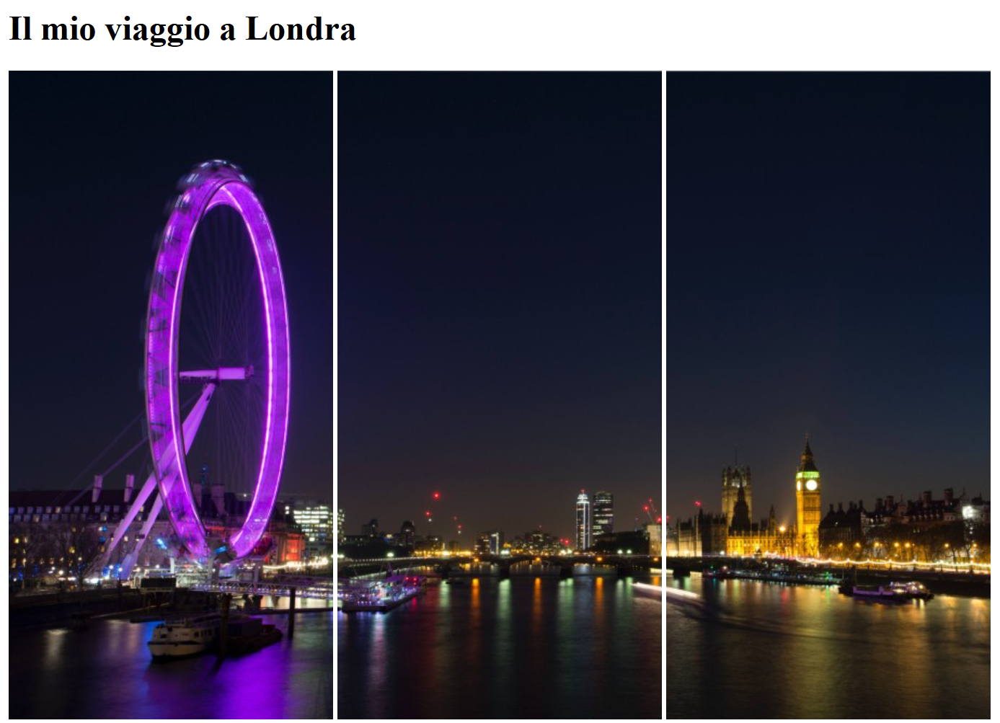
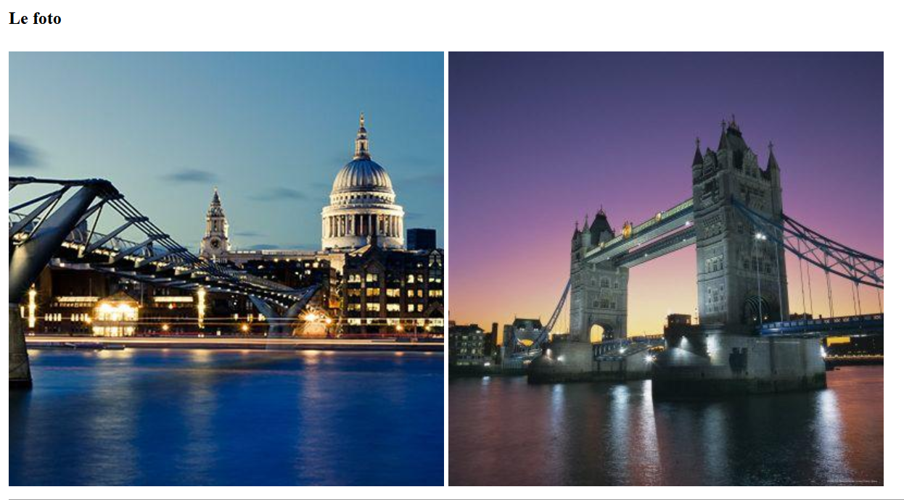

  

<h1 align="center">London Trip</h1>

  Pagina HTML statica che riproduce un semplice layout “London Trip”,
  con focus sulla struttura del documento e sulla gestione delle immagini.

## Obiettivo
- Riprodurre il layout fornito;
- Organizzare le immagini in una cartella `img`;
- Caricare le prime immagini tramite path relativi e le ultime tramite URL assoluti.

## Anteprima

## Tecnologie utilizzate

- HTML5

